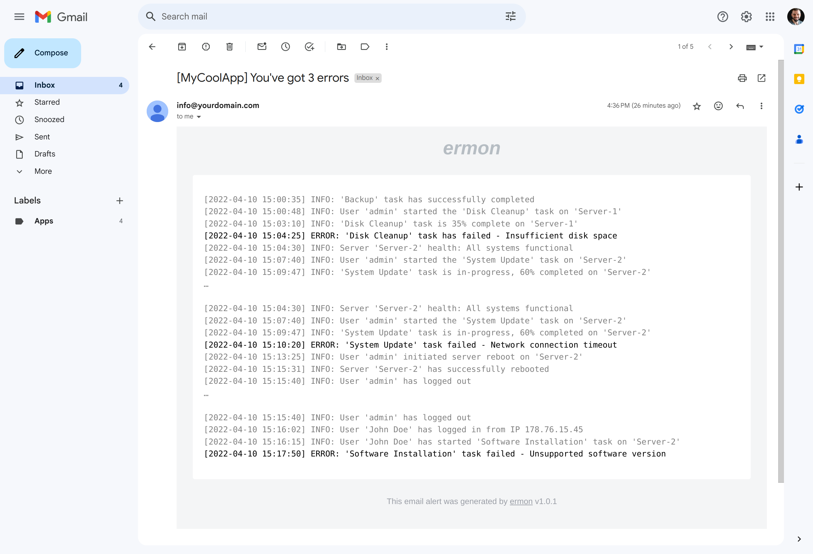

<p align="center">
<h1 align=center><i>ermon</i></h1>
</p>

<p align=center>Simple error monitoring 🧐 and email alerting tool 📨</p>

<p align="center">
<a href="#how-it-works">How it works</a> &nbsp;&bull;&nbsp;
<a href="#download">Download</a> &nbsp;&bull;&nbsp;
<a href="#configure">Configure</a> &nbsp;&bull;&nbsp;
<a href="#use">Use</a>
</p>



# How it works

`ermon` is a simple error monitoring and email alerting tool. It's written in Go and provided as a single binary. It's easy to use and doesn't require any dependencies.

You pass the output (logs) of your application to ermon, and it will send you an email if it finds errors or any lines that match the provided pattern (regular expression).

## Download

1. Go to the [releases](https://github.com/gornostal/ermon/releases) page and download the latest version. Look for a file named `ermon`.
2. Make the file executable: `chmod +x ermon`

## Configure

Copy and update the sample configuration provided below. Save it with any name, for example `.ermon`.

```ini
# Each configuration option below can be also provided as via ENVIRONMENT VARIABLES variables.
# They take precedence over the configuration file.

# [required] SMTP server host.
# If you own a domain and have AWS account, the easiest way to send emails is to use AWS SES.
# In a nutshell, what you need to do is
# 1. Verify your domain in the AWS SES console (https://docs.aws.amazon.com/ses/latest/dg/creating-identities.html)
# 2. Create SMTP credentials (https://docs.aws.amazon.com/ses/latest/dg/smtp-credentials.html)
# 3. Use the provided SMTP server and credentials in the configuration file.
# 4. Make sure your domain is not in the sandbox mode (https://docs.aws.amazon.com/ses/latest/dg/request-production-access.html) or verify the "mail to" address (https://docs.aws.amazon.com/ses/latest/dg/creating-identities.html).
# Alternatively, find a different SMTP server. Google for "smtp server for testing".
SMTP_HOST=your-smtp-host
# SMTP server port. Default is 25
SMTP_PORT=25
# Provide these if your SMTP server requires authentication
SMTP_USERNAME=xxx
SMTP_PASSWORD=yyy

# [required] Will be used in the email subject
ERMON_APP_NAME=MyCoolApp
# [required] Email address to send alerts from
ERMON_MAIL_FROM=noreply@yourdomain.com
# [required] Email address to send alerts to
ERMON_MAIL_TO=max@max.com
# [required] Regex pattern to match the error lines
# ermon uses Go's regexp package, so you can use any valid Go regular expression.
# the example below will match any line that contains the word "error" or "exception". (?i) makes the pattern case-insensitive.
ERMON_MATCH_PATTERN=(?i)error|exception
# Optionally you can provide a pattern to ignore, which will prevent ermon from treating the line as an error.
ERMON_IGNORE_PATTERN=not found
# To avoid sending too many emails, you can limit the number of emails sent per hour. Default is 4.
ERMON_MAX_EMAILS_PER_HOUR=4
```

## Use

The simplest way is to use a pipe to pass the output of your application to ermon. For example: `npm run start 2>&1 | ./ermon`

If your configuration file is not named `.ermon`, pass the path to it as an argument: `./ermon /path/to/your/config`

A more advanced way, and one that is useful for containerized applications, is to use a shell script like this as your entrypoint:

```bash
#!/usr/bin/env bash

set -o pipefail

yourapp 2>&1 | ./ermon
```

`set -o pipefail` will make the script exit with the exit code of `yourapp`. This way, the container orchestration tool will know that your app failed and will restart the container if you have such a policy.
